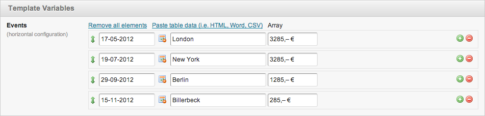
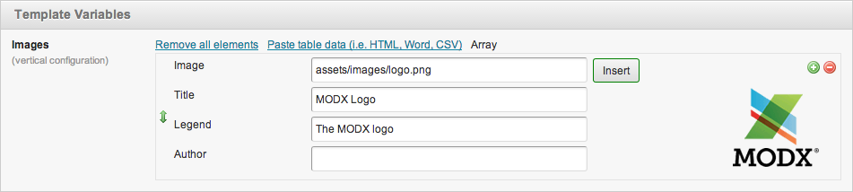
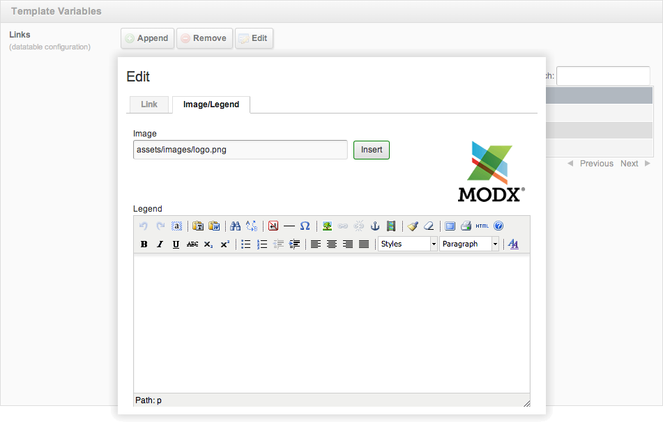

# multiTV

[multiTV](https://github.com/Jako/multiTV) is a package for MODX Evolution content management framework.

## Features

With this MODX Evolution package a new template variable type is introduced. The template variable could contain a sortable multi item list or a datatable.

The package contains three main parts

- a custom template variabe displaying and editing a sortable multi item list or a datatable
- a snippet to display the value of the template variable
- a module do edit the content of custom database tables.

and some extras

- a PHx modifier
- a Ditto filter extender
- a snippet for old installations to update the template variable content to the new format introduced with version 1.4.11.

## Screenshots

Events (horizontal mode)  

Images example (vertical mode)  

Links (datatable mode)  

Edit Link (datatable mode)  

Database Manager (log_event configuration)  

<!-- Piwik -->

<noscript>

</noscript>
<!-- End Piwik Code -->
